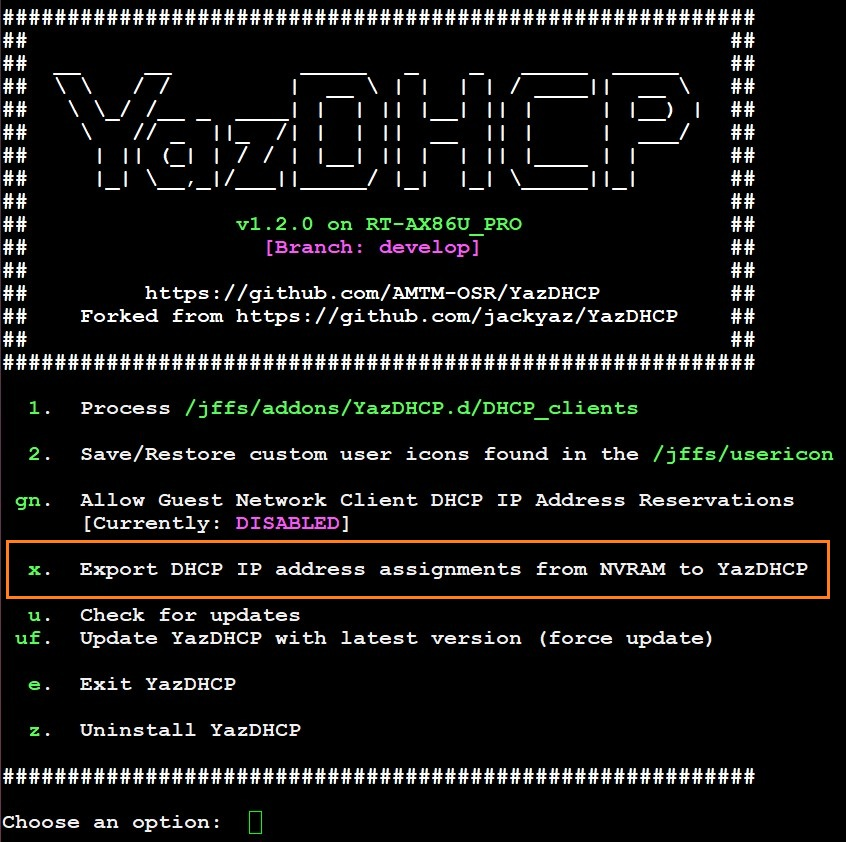

# YazDHCP

## v1.2.2

### Updated on 2025-Oct-30

## About

Feature expansion of DHCP assignments using AsusWRT-Merlin's [Addons API](https://github.com/RMerl/asuswrt-merlin.ng/wiki/Addons-API) to read and write DHCP assignments, increasing the limit on the number of reservations.

YazDHCP is free to use under the [GNU General Public License version 3](https://opensource.org/licenses/GPL-3.0) (GPL 3.0).

## Supported firmware versions

You must be running firmware Merlin 384.15/384.13_4 or later [Asuswrt-Merlin](https://asuswrt.lostrealm.ca/)

## Installation

Using your preferred SSH client/terminal, copy and paste the following command, then press Enter:

```sh
/usr/sbin/curl -fsL --retry 3 "https://raw.githubusercontent.com/AMTM-OSR/YazDHCP/master/YazDHCP.sh" -o "/jffs/scripts/YazDHCP" && chmod 0755 /jffs/scripts/YazDHCP && /jffs/scripts/YazDHCP install
```

## Usage

YazDHCP leverages the existing [LAN - DHCP Server](http://router.asus.com/Advanced_DHCP_Content.asp) page in the AsusWRT-Merlin WebUI. It has been modified under the hood to read and write to files in /jffs/addons/YazDHCP.d/ via the Addons API.

This allows us to use a greater amount of storage (~7KB vs 2.5-3KB) for DHCP IP address and hostname assignments.

To launch the command line menu for YazDHCP after installation, use:

```sh
YazDHCP
```

If you do not have Entware installed, you will need to use the full path:

```sh
/jffs/scripts/YazDHCP
```

## Changes made to dnsmasq configuration

YazDHCP adds 2 lines to dnsmasq.conf.add to configure DHCP IP address reservations:

```sh
dhcp-hostsfile=/jffs/addons/YazDHCP.d/.staticlist #YazDHCP_staticlist#
dhcp-optsfile=/jffs/addons/YazDHCP.d/.optionslist #YazDHCP_optionslist#
```

**dhcp-hostsfile** contains a list of MAC-address-to-IP-address bindings to reserve a specific DHCP IP address for a MAC address.

**dhcp-optsfile** contains a list of MAC-address-to-DNS-server-address bindings to provide the specified DNS server as a DHCP option for a MAC address.


## DHCP IP Address Reservations for Guest Network Clients

Starting with YazDHCP 1.2.0 version, a new feature was added to allow assigning DHCP IP address reservations to clients on available Guest Networks whose subnet is separate from the main LAN subnet.

### DETAILS

1) When YazDHCP is a fresh installation (***not*** a version update), the script automatically checks if there are any DHCP IP address reservations stored in **NVRAM**. If found, it will prompt the user to confirm exporting all the existing reservations from NVRAM to YazDHCP internal files. This export process extracts all the relevant information to create the initial list of network clients from both the Main LAN and the Guest Networks (if any). Also, it allows users to restore the same IP address reservations to their original NVRAM state if you decide to uninstall YazDHCP at a later time.


2) If a current production version of YazDHCP is already installed, updating to the latest version will add an option '**x**' in the SSH CLI menu to export any existing DHCP IP address reservations stored in NVRAM (if found). If this option is selected, the same export process triggered during a fresh installation will run.



3) After the export of the **NVRAM** DHCP information is completed, any existing IP address reservations from Guest Networks will be shown as **DISABLED** (i.e. red background). Also, by default, if at least one suitable Guest Network is found enabled/active, the new feature is set to **DISABLED**, so the original behavior and functionality continue to run as usual.


4) If at least one suitable Guest Network is found enabled/active, you will need to manually **ENABLE** the feature to activate all the Guest Network IP address assignments and to allow the user to input more entries. Make sure to click on the "**Apply**" button at the bottom of the WebUI page to make any changes permanent.


5) After a Guest Network client IP address reservation is assigned, it will not be automatically removed from the WebUI page even if the feature is manually DISABLED, or if the Guest Network is DISABLED. However, the files associated with the dnsmasq instance will have the Guest Network client entries removed automatically.


6) You can manually add IP address reservations for Guest Network clients as long as the target Guest Network remains enabled and active.

7) When assigning a new IP address reservation, the code will check if it falls within the subnet range of an available Guest Network in addition to the main LAN subnet; otherwise, an error message is displayed.

8) The menu option to toggle the new functionality will be grayed out and marked as **UNAVAILABLE** if there are no enabled Guest Networks whose subnet is separate from the main LAN subnet.


9) Whenever the YazDHCP WebUI page is loaded, you will see an 8-to-10 sec. "loading" delay due to the JavaScript call to the shell script requesting a check-and-validation status of each client entry, so the script executes code to validate all the existing client IP address assignments against all the Guest Networks profiles currently found enabled (or possibly disabled), to make sure that the associated virtual interfaces have been identified, and the appropriate dnsmasq directives have been issued to the correct dnsmasq instance associated with each Guest Network.


### IMPORTANT NOTE

YazDHCP will ***not*** export or transfer any IP address reservations found in user-supplied custom files (e.g. /jffs/configs/dnsmasq*.conf.add) into its own internal files. Only NVRAM-based DHCP settings are checked and transferred.


The reason is that, unlike the built-in NVRAM key-value pairs, the format of the dnsmasq directives found in user-supplied custom files is not fixed and consistent, so it can vary widely because the order of the parameters in the dnsmasq directive lines is essentially "free form."

So if you have created such custom files, you basically have 3 choices to transfer your current IP address assignments to YazDHCP:

a) Manually transfer the IP address assignments back into **NVRAM** by inputting them into the corresponding WebUI page for each Guest Network profile. Once this is completed, you can use the SSH CLI 'x' menu option to trigger the export process.

b) Manually transfer the IP address assignments directly into the YazDHCP internal CSV-formatted client list (/jffs/addons/YazDHCP.d/DHCP_clients) by following the required format shown below:

```
MAC,IP,HOSTNAME,DNS
```

EXAMPLES:
```
MAC,IP,HOSTNAME,DNS
AA:BB:CC:DD:EE:FF,192.168.50.10,,
AB:BC:CD:DE:EF:FA,192.168.50.11,MyHostName1,
FF:EE:DD:CC:BB:AA,192.168.50.12,MyHostName2,9.9.9.9
```

Once you have finished adding all the entries into the internal client list file, you can use the SSH CLI '**1**' menu option to process the newly-modified list.


c) If you prefer making the above changes offline on your personal laptop using your favorite text editor, or perhaps using MS Excel, you could export to CSV your current client list using the WebUI:


Then manually add your IP address reservations to the CSV file. After you have finished making all the changes and additions, you can then import the modified file back into YazDHCP using the WebUI page. Once you're satisfied with all your changes, make sure to click on the "**Apply**" button to make them persistent.

Also, it's very important to make sure you ***remove*** all IP address reservations from your custom files that have been transferred to YazDHCP to prevent dnsmasq from getting duplicate entries/directives, which is bound to cause some issues when restarting the dnsmasq process.

## "DHCP Lease" time values

The "DHCP Lease" input field has been enhanced to accept a maximum value of 7776000 seconds (90 days). Values can be entered in seconds (e.g. 86400s), minutes (e.g. 1440m), hours (e.g. 24h), days (e.g. 2d), or weeks (e.g. 2w). A single digit ZERO '0' or an upper-case letter 'I' indicates that an "infinite" lease time value will be applied.

## "Back up & Restore" custom user icons

You can save a backup of the custom user icons found in the "/jffs/usericons" directory, and you can later select one of the backup files to restore the icons files as needed. The command line interface allows you to change the directory path where the backup subdirectory is located, and you have option to delete backup files, or list the contents of a backup file. The default maximum number of backup files to keep is 20, but you can change this maximum setting (between min=5 to max=50) using the CLI menu.

### NOTES

1) The current implementation of the "Back up & Restore" of custom user icons does *NOT* export to or import from an external PC or client device connected to the router. Instead, it targets a directory available either on the router's JFFS partition or in a USB-attached disk drive. This target directory is where the subdirectory for backups is created and can be modified using the CLI menu (see note #3 below).
2) The CLI main menu option 2 for the "Back up & Restore" functionality will show up only if there is at least one custom user icon file found in the "/jffs/usericon" directory, or if at least one backup file is found in the directory path defined for backups. If none of those 2 conditions is met, the option 2 will not show up in the main menu.
3) To start using the "Back up & Restore custom user icons" feature, it's highly recommended to set the target directory where the subdirectory for backups is to be located (see option "dp" in the CLI menu). For the backups subdirectory to survive a "Factory Defaults Reset" of the router, it's highly recommended to use a directory path located on a disk drive plugged in to one of the router's USB ports. You don't have to have Entware installed on the USB-attached disk; any USB disk drive formatted with either NTFS or ext4 is sufficient to use as storage for the backup files.

## Help

Please post about any issues and problems here: [YazDHCP on SNBForums](https://www.snbforums.com/forums/asuswrt-merlin-addons.60/?prefix_id=31)

### Scarf Gateway

Installs and updates for this addon are redirected via the [Scarf Gateway](https://about.scarf.sh/scarf-gateway) by [Scarf](https://about.scarf.sh/about). This allows me to gather data on the number of new installations of my addons, how often users check for updates and more. This is purely for my use to actually see some usage data from my addons so that I can see the value provided by my continued work. It does not mean I am going to start charging to use my addons. My addons have been, are, and will always be completely free to use.

Please refer to Scarf's [Privacy Policy](https://about.scarf.sh/privacy) for more information about the data that is collected and how it is processed.
